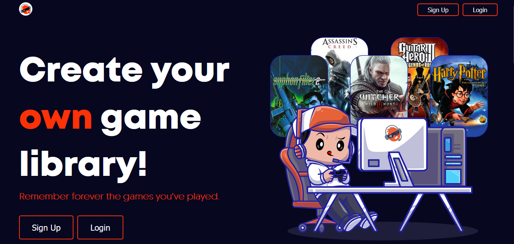

<h1 align="center" id="title">Project IronHack - GamersBin</h1>

<p id="description">Created to be a virtual library of games GamersBin is a project designed to help gamers remember the games they've played and that have left a mark on their lives.</p>

<h2>🚀 Demo</h2>

[https://gamersbin.vercel.app](https://gamersbin.vercel.app)

<h2>Project Screenshots:</h2>



<h2>🛠️ Installation Steps:</h2>

<p>1. Clone the repository</p>

```
git clone repo_url
```

<p>2. Install npm modules</p>

```
npm install
```

<p>3. Start development server using below command</p>

```
npm run dev
```

  
  
<h2>💻 Built with</h2>

Technologies used in the project:

*   Node.js
*   React
*   MongoDB
*   react-router-dom
*   axios
*   Material UI